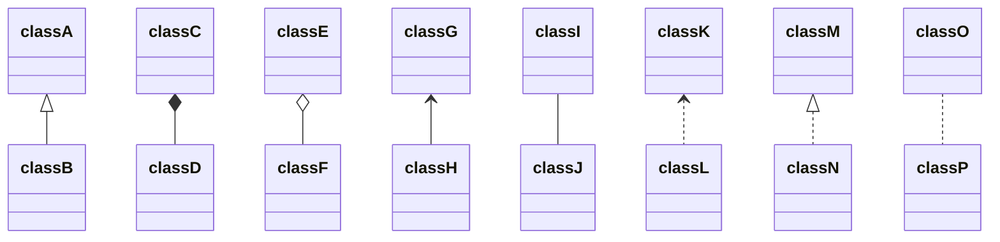

# Git gebruiken

In de eerste les leerden we wat Git is en hoe we Git kunnen gebruiken. 

## Wat is Git en GitHub?

Git is een manier om te delen wat je maakt, om samen te werken en te communiceren. Je kan er gemakkelijk ook versies van documenten bijhouden. Via Git wordt samenwerken een stuk gemakkelijker.
Git is een open-source version control system. Het houdt dus bij welke aanpassingen er zijn gebeurd. Je kan ook steeds terug gaan naar een vorige versie.

Er zijn verschillende providers van Git, waaronder GitHub (MicroSoft), GitLab, Bitbucket...

## Specifieke woordenschat

**Repositories (repo)** = je project, elke repo is een apart project

**Snapshot** = een aanduiding dat deze versie belangrijk is

**Commit** = het maken van een snapshot, dit heeft drie stukken informatie

> 1. Informatie over hoe je bestand is veranderd.
> 2. Een link naar je vorige commit (parent commit).
> 3. Een code (kan zoiets worden: fb2d2ec5069fc)

**Cloning** = een exacte kopie van je repo maken

Er hoeft ook niet altijd internet te zijn. Want je kan wijzigingen maken op je computer, via een code-editor, zoals brackets, notepad++... en dan die wijzigen 
**pushen** naar je **remote server**. Wijzigingen die op de **remote server** maakt, moet je **pullen** om de nieuwste versie op je **working directory** te hebben.
Je kan ook een **pull request** uitsturen. Dan wordt eerst de inhoud gereviewd, na de aanpassingen kan de request beantwoord worden en worden de versies samengevoegd. Zo wordt dat gedaan in grote bedrijven.
**Pull** = je online versie opvragen en naar je computer trekken
**Push** = je versie op je computer naar je online versie duwen
**Remote server** = online, vb. GitHub
**Working directory** = je computer
**Pull request**= aanpassingen aanbieden

**Branches** = vertakkingen om bijvoorbeeld iets anders uit te proberen

> _Bijvoorbeeld_: Je bent een T-shirt aan het ontwerpen en je wilt uitproberen hoe het er uit zal zien met lange en met korte mouwen. Dan maak je een **branche** van die met korte mouwen, op je origineel werk je verder met lange mouwen. Op het einde kan je dan kiezen welke je de beste vindt.

**Master** = je hoofdvertakking

**Head** = huidige actieve branche, je head wordt telkens verplaatst over de verschillende branches afhankelijk van waar je aan werkt

**Merging** = samenvoegen

C2  <- C4  <---------------- C6 

    <- C3  <-  C5  <---

> Je hebt je tweede versie (C2), daarin maak je twee **branches** (C4 en C3). Deze **branches** verwijzen naar de vorige versie (C2), want daar zijn ze van afkomstig. Vanuit C3 maak je een nieuw commit, dat wordt dan C5 (want C4 bestaat al). Daarna **merge** je C4 en C5, dat wordt C6. 

**fork** = een eigen versie maken van een repo. Dit kan je doen door op de fork-knop te klikken die je rechtsboven in je scherm vindt.

**markdown** = dit zijn je tekstbestanden. Deze kan je opmaken door de juiste codes te gebruiken. Deze bespreek ik later. Het is altijd mogelijk om de code te vergelijken (bewerken) met de bijhorende pagina op de website. Bijvoorbeeld met de pagina markdown elements.

## Lesverloop

Na de intro over Git en GitHub, aanbrengen van de woordenschat en het maken van een fork, zijn we over gegaan naar het uitproberen van enkele nieuwigheden.

We hebben eerst een website gegenereerd. Dit door naar **Settings** te gaan en naar beneden te scrollen tot **GitHub Pages**. Bij **Source** ga je je branche moeten aanduiden. Hier waren er weinig mogelijkheden, enkel **Master** of **None**, waaruit wij **Master** kozen.

Daarna hebben we onze repo op onze working directory geplaatst. Daarvoor was het nodig om de GitHub desktop te installeren. Men had gevraagd om dit op voorhand te doen, wat ik ook gedaan heb. 
Om dan mijn repo op mijn working directory te kunnen bewerken, ga ik naar het programma GitHub desktop. Aanmelden, repo aanduiden en dan _own purposes_ aanduiden. Als alles goed is gegaan, is de repo terug te vinden in mijn documenten. Dat was het geval. 
Om mijn repo te editten op mijn computer heb ik brackets.io gedownload, wat werkt op Linux. Voor Windows kan je ook notepad++ gebruiken en voor Mac ook brackets of atom. Online editten kan ook altijd.

Om nieuwe tabbladen te maken (op de website aan de linkerkant), kan ik later nog mapjes maken en er een README.md file in te plaatsen. Dit file bevat: sort:... (welke positie op website) en #  (titel). Je kan er ook een tekst aan toevoegen, bijvoorbeeld _Hier komen alle lessen_. Deze tekst is terug te vinden op het overzicht met alle tabbladen. Je kan een nieuw tabblad toevoegen door op _add file_ te klikken.

De les werd afgesloten met een opdracht, namelijk een pagina over jezelf maken. Mijn pagina vind je [hier](https://celinevandeweghe.github.io/fabzero-CelineVandeweghe/Opdrachten/01UseGit.html). Verder kunnen er nog dingen aan de website toegevoegd worden, een vrije keuze. Deze pagina is een onderdeel van mijn aanvullingen.

## Codes tekstopmaak

Dit zijn de codes die je hebt meeste nodig hebt:

> ** tekst ** = **tekst** (zonder spaties)

> _ tekst _ = _tekst_ (zonder spaties)

> ~~ tekst ~~ = ~~tekst~~ (zonder spaties)

> [Naam]( https://www. ateliercelinel.com ) = [Naam](https://www.ateliercelinel.com) (zonder spaties en naam kan je veranderen naar een woord of zin naar keuze)

> _Foto's van het internet_: Sla de afbeeldingslocatie op door met je rechtermuisknop op _Copy Image Location_ te klikken
>  =  (zonder spaties)

> _Foto's uit je repo_: Sla eerst je foto's op in de map _assets_ op je computer
>  =  (zonder spaties)
> (vervang schilderij.jpg door je bestandsnaam)

(>) om een insprong te hebben
> zoals hier

## Whatsapp

Voor de handigheid heeft de groep van FabZero 2 een whatsapp-groep. Een handige tip deel ik hier: verklein je foto's niet in Git, maar wel voordat je deze op Git plaatst. Dat kan je gemakkelijk online doen. Ik zoek altijd op foto verkleinen en dan helpt internet je wel verder.

